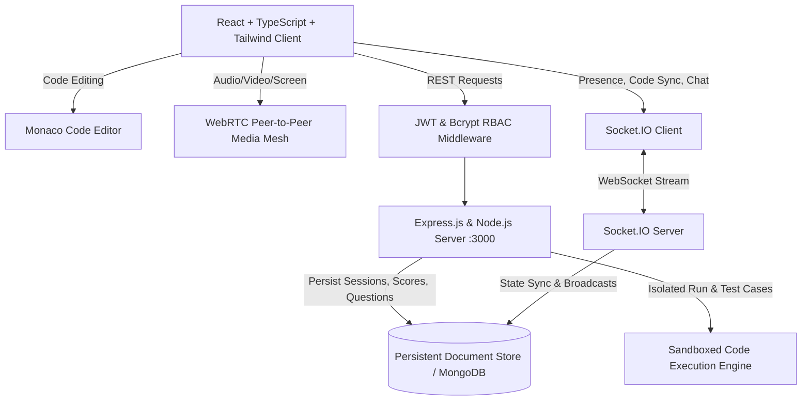

# Intervexa – Online Technical Interview & Coding Platform

Intervexa is a production-grade, full-stack technical interview platform engineered for conducting real-time coding evaluations, system design discussions, and candidate scorecards.

---

## Architecture Diagram



---

## Key Features

1. **Candidate Dashboard**:
   - Upcoming technical interviews with 1-click room launch
   - Completed interviews with historical grade records
   - Interactive feedback reports and hiring decisions
   - Profile management (skills, experience, education, bio)
   - Real-time invitations and notifications

2. **Interviewer Console**:
   - Create and schedule 5 interview types: *Technical, Coding, HR, System Design, Full Stack*
   - Select algorithmic challenges from the seeded problem database
   - Add technical questions from the question bank or formulate custom questions
   - Structured 7-category evaluation system with automatic scoring
   - Real-time collaborative notes

3. **Real-Time Interview Room**:
   - **Left Panel**: WebRTC peer-to-peer video/audio calling, camera & microphone muting, screen sharing, network health indicator
   - **Center Panel**: Monaco Editor with multi-language syntax highlighting, font scaling, starter code reset, and remote participant cursor sync
   - **Right Panel**: Tabbed Problem Description, Technical Questions with discussion checks, Live Chat with role tags, and Collaborative Notes
   - **Bottom Console**: Sandboxed "Run Code" against sample inputs, "Submit Solution" against all hidden test cases, Runtime (ms) and Memory (KB) calculation, and End Interview trigger

4. **Coding Problems & Sandboxed Execution**:
   - Seeded algorithmic problems: *Two Sum, Valid Parentheses, Reverse Linked List, Binary Search, Maximum Subarray, Merge Intervals, BFS Level-Order, DFS Number of Islands*
   - Supports JavaScript, TypeScript, Python, Java, C++
   - Isolated execution sandbox with system token stripping (`require`, `process`, `fs`) to protect server integrity

5. **Curated Technical Question Bank**:
   - Comprehensive questions with interviewer answer guides across JavaScript, React, Node.js, Databases, DSA, and System Design

6. **Candidate Evaluation & Result Page**:
   - 7 Core Categories: DSA, Problem Solving, Programming, Technical Knowledge, Communication, System Design, Code Quality (1–10)
   - Automatically computes Total Score (out of 70) and Average Score (out of 10)
   - Hiring recommendation badge: *Selected*, *Further Evaluation*, *Rejected*
   - Granular coding statistics (Problems Solved, Automated Test Cases Passed)

7. **Administration & Analytics**:
   - User account lifecycle controls (activate / deactivate accounts)
   - Platform metrics: Total Users, Candidates, Interviewers, Total Interviews, Completed vs Scheduled ratio, Global Average Score
   - Question bank content authoring

---

## Tech Stack

- **Frontend**: React 19, TypeScript, Tailwind CSS, Monaco Editor (`@monaco-editor/react`), Lucide Icons, Socket.IO Client
- **Backend**: Node.js, Express.js, Socket.IO, JWT (`jsonwebtoken`), Bcrypt (`bcryptjs`), Sandboxed VM (`vm`)
- **Database**: High-performance persistent JSON Document Engine with Mongoose-compatible schema API (supports MongoDB Atlas via `MONGODB_URI`)

---

## Seeded Demo Personas

Intervexa includes pre-configured demo accounts for immediate testing:

| Role | Name | Email | Password |
| :--- | :--- | :--- | :--- |
| **Candidate** | Alex Rivera | `candidate@intervexa.com` | `password123` |
| **Interviewer** | Sarah Chen | `interviewer@intervexa.com` | `password123` |
| **Admin** | Eleanor Vance | `admin@intervexa.com` | `password123` |

You can also use the **"Role Switcher"** button in the top navigation bar to instantaneously toggle between roles.

---

## REST API Specification

### Authentication
- `POST /api/auth/register` – Register candidate or interviewer
- `POST /api/auth/login` – Issue JWT session token
- `POST /api/auth/logout` – Clear session
- `GET /api/auth/me` – Retrieve authenticated user and profile

### Interviews
- `GET /api/interviews` – List interviews (filtered by participant role)
- `POST /api/interviews` – Schedule new interview (Interviewer/Admin)
- `GET /api/interviews/:id` – Retrieve interview details and assigned problems
- `PUT /api/interviews/:id` – Update interview metadata or notes
- `DELETE /api/interviews/:id` – Delete interview schedule
- `POST /api/interviews/:id/join` – Join interview session
- `POST /api/interviews/:id/end` – Conclude interview session

### Code Submissions
- `POST /api/submissions` – Execute code in sandbox or submit against hidden test cases
- `GET /api/submissions` – List submission history

### Evaluation & Feedback
- `POST /api/interviews/:id/feedback` – Record 7-category scoring and review
- `GET /api/interviews/:id/feedback` – Retrieve official evaluation report

### Questions & Problems
- `GET /api/questions` – Browse technical question bank
- `POST /api/questions` – Add new question (Interviewer/Admin)
- `GET /api/problems` – Browse algorithm challenges
- `GET /api/problems/:id` – Get problem test cases and starter templates

### Users & Administration
- `GET /api/users` – List platform users
- `PUT /api/users/:id` – Update profile or toggle active/disabled status
- `GET /api/users/stats` – Global platform metrics

---

## Environment Variables

Defined in `.env.example`:
```env
PORT=3000
NODE_ENV=development
JWT_SECRET=intervexa_super_secret_jwt_key_replace_in_production
JWT_EXPIRES_IN=7d
MONGODB_URI=mongodb://localhost:27017/intervexa
```

---

## Automated Testing

Run the included automated verification suite:
```bash
npm test
```
Tests verify:
- Bcrypt password hashing and verification
- JWT token payload encryption and signature verification
- Sandboxed code execution with Two Sum algorithm
- Sandboxed security layer intercepting disallowed module tokens
- Document database CRUD operations
- Evaluation category summation and score normalization

---

## Production Deployment

- **Frontend**: Vite build assets (`npm run build`)
- **Backend**: Express + Socket.IO server (`node server.ts` or `tsx server.ts`)
- Configured to bind on port 3000 with CORS and WebSocket upgrade support.
